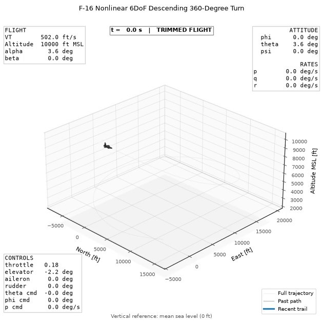

# F-16 Flight Dynamics — Nonlinear 6DoF Simulation and Control

This repository implements a Python-based F-16 flight-dynamics simulation and analysis environment: a nonlinear rigid-body model, straight-and-level trim, numerical linearization, dynamic-mode analysis, feedback-control design, local linear/nonlinear validation, and 3D flight visualization. The aircraft motion in the final animation is generated from the integrated nonlinear states and feedback-controller commands—not from a predefined animation path.

Final nonlinear flight demonstrations:

<div align="center">
  
  &emsp;&emsp;&emsp;
  
</div>

## Flight Demo

The 110 s demonstration starts from a 502 ft/s sea-level trim and proceeds through level flight, a climbing turn, an opposite-direction S-turn, recovery, a commanded axial roll, a U-turn, a curved exit, another recovery, a final turn, and a straight departure. Position and attitude are produced by the integrated nonlinear state history.

## Engineering Workflow

```text
Nonlinear 6DoF Model → Trim → Linearization → Dynamic Modes
        → Control Design → Nonlinear Simulation → Validation
        → Flight Visualization
```

## Key Features

- Nonlinear rigid-body translational and rotational dynamics in SI units
- North-East-Down (NED) navigation frame and forward-right-down (FRD) body frame
- Scalar-first quaternion attitude propagation with normalization during RK4 integration
- Reduced F-16 aerodynamic tables, damping/control derivatives, and CG corrections
- Altitude/Mach-dependent thrust tables and a dynamic engine-power state
- Simplified source-model atmosphere and air-data calculations
- Symmetric straight-and-level trim by numerical optimization
- Centered finite-difference longitudinal and lateral-directional linearization
- Short-period, phugoid, Dutch-roll, roll-subsidence, and spiral-mode analysis
- Pitch-rate, pitch-attitude, yaw-rate, roll-rate, and bank-angle feedback analysis
- Nonlinear open-loop, closed-loop, and augmented-controller simulation
- Automated physics, source-reference, regression, controller, export, and visualization tests
- Matplotlib 3D trajectory and aircraft animation

## Nonlinear Equations of Motion

The state is

$$
\mathbf{x}=[N,E,D,u,v,w,q_0,q_1,q_2,q_3,p,q,r,P_e]^T,
$$

where $[N,E,D]$ is NED position, $[u,v,w]$ is body-FRD velocity, $[q_0,q_1,q_2,q_3]$ is a scalar-first unit quaternion, $[p,q,r]$ is body angular velocity, and $P_e$ is engine power. The quaternion and $C_{n\rightarrow b}$ describe the NED-to-body rotation. The implemented rigid-body equations are

$$
\dot{\mathbf{r}}_n=C_{n\rightarrow b}^{T}\mathbf{v}_b,
$$

$$
\dot{\mathbf{v}}_b=\frac{\mathbf{F}_b}{m}
+C_{n\rightarrow b}\begin{bmatrix}
0\\
0\\
g
\end{bmatrix}
-\boldsymbol{\omega}_b\times\mathbf{v}_b,
$$

$$
\dot{\mathbf{q}}=\frac{1}{2}\Omega(\boldsymbol{\omega}_b)\mathbf{q},
$$

$$
\dot{\boldsymbol{\omega}}_b=J^{-1}\left[\mathbf{M}_b-
\boldsymbol{\omega}_b\times\left(J\boldsymbol{\omega}_b+\mathbf{h}_e\right)\right].
$$

Aerodynamic force and thrust are included in $\mathbf{F}_b$; gravity is added separately. The constant engine rotor angular momentum $\mathbf{h}_e$ lies along body $+x$. Controls are $[\delta_T,\delta_e,\delta_a,\delta_r]^T$: dimensionless throttle and elevator, aileron, and rudder angles in degrees.

## F-16 Aerodynamics, Propulsion, and Atmosphere

The aerodynamics follow the reduced F-16 model documented in Stevens, Lewis, and Johnson. Body-axis $C_X,C_Y,C_Z,C_l,C_m,C_n$ combine tabulated or analytic base coefficients with nondimensional $p$, $q$, and $r$ damping terms, aileron/rudder derivatives, and pitching/yawing moment corrections for CG position. Tables are linearly or bilinearly interpolated; out-of-grid values are extrapolated from the nearest edge cell rather than clamped.

Dimensional loads use dynamic pressure, wing area, span, and mean aerodynamic chord. Propulsion interpolates idle, military, and maximum thrust versus altitude and Mach. Throttle maps to commanded power, while the fourteenth state supplies a piecewise engine response; thrust acts along body $+x$. The atmosphere reproduces the source model's simplified density, temperature, Mach, and dynamic-pressure calculation rather than a complete modern atmosphere or weather model.

## Straight-and-Level Trim

`trim_straight_level` solves for $[\delta_T,\delta_e,\alpha]$ at specified airspeed, altitude, and CG. The constructed state imposes zero sideslip, bank, yaw, and body rates, sets pitch attitude equal to angle of attack, and initializes engine power consistently. Nelder-Mead minimizes weighted residuals in $\dot V_T$, $\dot\alpha$, and $\dot q$; acceptance also requires every physical residual to satisfy its tolerance.

The analysis and demo use 502 ft/s at sea level with CG at 0.30 mean aerodynamic chord. Obtain current numerical trim values directly:

```bash
python -c "from src.f16sim.parameters import FT_TO_METER; from src.f16sim.trim import trim_straight_level; print(trim_straight_level(502*FT_TO_METER, 0.0, cg_fraction=0.30))"
```

This is a symmetric straight-and-level solver, not a general turning-flight trim solver.

## Numerical Linearization

Centered finite differences produce

$$
\delta\dot{\mathbf{x}}=A\,\delta\mathbf{x}+B\,\delta\mathbf{u}
$$

about a trim point:

| Model | Perturbation states | Perturbation controls |
|---|---|---|
| Longitudinal | $[V_T,\alpha,\theta,q]$ | $[\delta_T,\delta_e]$ |
| Lateral-directional | $[\beta,\phi,p,r]$ | $[\delta_a,\delta_r]$ |

Both reduced derivative functions map their variables into the full nonlinear 14-state model before extracting the corresponding rates.

## Aircraft Dynamic Modes

Eigenvalues identify the longitudinal short-period and phugoid pairs and the lateral Dutch-roll, roll-subsidence, and spiral modes. For $\lambda=\sigma\pm j\omega_d$,

$$
\omega_n=|\lambda|,\qquad \zeta=-\frac{\sigma}{\omega_n}.
$$

The longitudinal implementation classifies its pairs by natural frequency. Lateral scripts use eigenvalues and eigenvector participation to distinguish Dutch roll, fast roll subsidence, and the slow spiral pole.

## Control Design

The final demo uses proportional cascades whose gains are analyzed with pole/root-locus and response scripts. They are design-point values for 502 ft/s at sea level, not universally optimal or gain-scheduled values.

```text
theta_cmd → Ktheta=0.5 → q_cmd → Kq=5.0 pitch-rate feedback → elevator
phi_cmd   → Kphi=1.0   → p_cmd → Kp=5.0 roll-rate feedback  → aileron
                                  Kr=50.0 yaw-rate feedback  → rudder
```

Using the model's FRD and control signs,

$$
\Delta\delta_e=K_q(q-q_{cmd}),\quad
\delta_a=K_p(p-p_{cmd}),\quad
\delta_r=K_r r.
$$

The reusable controller contains the pitch cascade; lateral laws are explicit in the analysis and maneuver scripts. Separate tools sweep pitch-rate, pitch-attitude, pitch-attitude PI, yaw-damper, roll-rate, and bank-angle gains. PI pitch attitude is analyzed and simulated separately, but the final demo uses the proportional cascade above.

## Linear vs. Nonlinear Validation

Validation applies the same small perturbations or feedback commands to reduced linear and full nonlinear models initialized at the same trim:

- `compare_linear_nonlinear_longitudinal.py` — 0.5° elevator pulse for 0.5 s
- `compare_linear_nonlinear_lateral_modes.py` — small initial sideslip and bank perturbations
- `compare_linear_nonlinear_attitude_maneuver.py` — closed-loop pitch command
- `compare_linear_nonlinear_bank_angle_maneuver.py` — closed-loop bank command
- `compare_yaw_damper_response.py` — lateral response with and without yaw damping

Agreement is expected locally around trim and for small perturbations—not across the full envelope. This connects the Jacobian design model back to the nonlinear equations that generate the final trajectories.

## Analysis and Results

No static plots are currently committed. The strongest existing figures can be reproduced with:

```bash
python scripts/plot_pitch_rate_root_locus.py
python scripts/analyze_yaw_damper_root_locus.py
python scripts/compare_linear_nonlinear_longitudinal.py
python scripts/compare_linear_nonlinear_bank_angle_maneuver.py
python scripts/animate_flight_demo.py --camera fixed
```

These cover longitudinal root locus, lateral pole trajectories, open-loop local validation, controlled linear/nonlinear validation, and the final trajectory. The embedded GIF is the saved final animation.

## Installation and Use

There is currently no packaging metadata or pinned dependency file. Create an environment with a recent Python 3 release and install the imported libraries:

```bash
python -m venv .venv
# Windows PowerShell
.venv\Scripts\Activate.ps1
python -m pip install numpy scipy matplotlib pytest
```

Run tests and open the final Matplotlib demo:

```bash
python -m pytest -q
python scripts/animate_flight_demo.py
```

The demo supports `--camera {fixed,chase}`, `--fps`, `--speed`, `--aircraft-scale`, and `--vertical-exaggeration`. MP4 export additionally requires FFmpeg available to Matplotlib:

```bash
python scripts/animate_flight_demo.py --save-mp4 --output f16_flight_demo.mp4
```

## Testing

The pytest suite covers vector/rotation utilities, quaternions, RK4 integration, rigid-body dynamics, air data and atmosphere, aerodynamic interpolation and loads, engine tables and dynamics, source-reference cases, trim, linearization, modal/control analysis, simulation, controllers, and visualization transforms. Some regression tests compare against printed F-16 cases while explicitly documenting discrepancies caused by internally inconsistent printed source values.

## Project Structure

```text
src/f16sim/   Core dynamics, model, trim, linearization, controls, visualization
scripts/      Analysis, validation, simulation, animation, and export entry points
tests/        Unit, physics, source-reference, and regression tests
media/        Final rendered flight-demo media
```

## Limitations

- Validity is bounded by the reduced aerodynamic/propulsion tables and edge-cell extrapolation.
- The simplified atmosphere has no wind, turbulence, weather, or sensor noise.
- Control-surface actuator dynamics, structural flexibility, aeroelasticity, and ground interaction are absent.
- The feedback laws are not a full F-16 flight-control computer; there is no gain scheduling, control allocation, envelope protection, or failure logic.
- Linear models and control conclusions are local to the selected trim.
- The low-poly Matplotlib aircraft mesh is a visual reference, not aerodynamic geometry.

## Reference

- Brian L. Stevens, Frank L. Lewis, and Eric N. Johnson, *Aircraft Control and Simulation*. The code cites the book's reduced F-16 model, Appendix A, and referenced Chapter 3 figures/tables for aerodynamic and engine data, atmosphere equations, configuration parameters, and validation cases.

## Disclaimer

This is an independent educational and engineering portfolio project. It is not affiliated with or endorsed by Lockheed Martin or the U.S. Air Force. “F-16” is used descriptively for the modeled aircraft.
